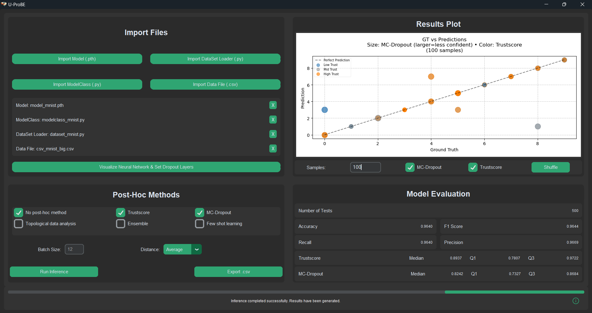

# U-ProBE



## Overview

**U-ProBE** (Uncertainty Prediction for Bayesian Estimations) is a Python software suite designed for analyzing deep learning models with uncertainty in predictions. Specifically, it focuses on medical image processing, including MRI and ultrasound images. The goal of this project is to develop a platform with a user-friendly interface that allows users to apply state-of-the-art techniques to evaluate the reliability of models through non-intrusive methodologies.

## Features

- **User Interface:** Built with CustomTkinter for an intuitive and interactive user experience.
- **DL Framework** - **DL Framework** Supports PyTorch models, used for maximum operability.
- **Inference Methods:** Supports various post-hoc methods to assess model reliability:
  - Trustscore
  - MC Dropout
  - Topological Data Analysis (TODO)
  - Deep Ensembling (TODO)
  - Few-Shot Learning (TODO)
- **File Handling:** Easily import model files, data loaders, and datasets.
- **Results Export:** Export inference results to CSV files for further analysis.
- **Neural Network Visualization** Easy visualization of the neural network architecture with the library VisualTorch.
- **Model Evaluation Metrics** Calculate the performance metrics of the model, such as accuracy, precision, recall, and F1 score.

## Installation

### Clone the Repository

To get started, clone the repository to your local machine:

```bash
    git clone https://github.com/lorenzobandini/U-ProBE.git
    cd U-ProBE
```

### Environment Setup

Create a Python environment using `environment.yml`:

```bash
    conda env create -f environment.yml
```

Alternatively, install the dependencies listed in `requirements.txt`:

```bash
    pip install -r requirements.txt
```

## Run the Application

Activate the environment:

```bash
    conda activate uprobe
```

Then run the application:

```bash
    python app.py
```

## Usage

- **Step 1:** Load the model file, data loader and dataset.
- **Step 2:** Select the desired post-hoc methods using the checkboxes.
- **Step 3:** Run the inference and view the results.
- **Step 4:** Export the results to a CSV file.

To contribute to the project, please follow these guidelines:

1. **Fork the Repository:** Click the "Fork" button at the top right of this page.

2. **Create a New Branch:** Create a new branch for your feature or bug fix:

    ```bash
    git checkout -b my-feature-branch
    ```

3. **Make Changes:** Implement your changes and test thoroughly.

4. **Commit Changes:** Commit your changes with a clear message:

    ```bash
    git add .
    git commit -m "Add feature X or fix bug Y"
    ```

5. **Push to GitHub:** Push your branch to your fork:

    ```bash
    git push origin my-feature-branch
    ```

6. **Create a Pull Request:** Open a pull request on GitHub and describe your changes.

## License

This project is licensed under the MIT License - see the [LICENSE](LICENSE.md) file for details.

## Code of Conduct

Please read the [CODE_OF_CONDUCT](CODE_OF_CONDUCT.md) before contributing to this project.
